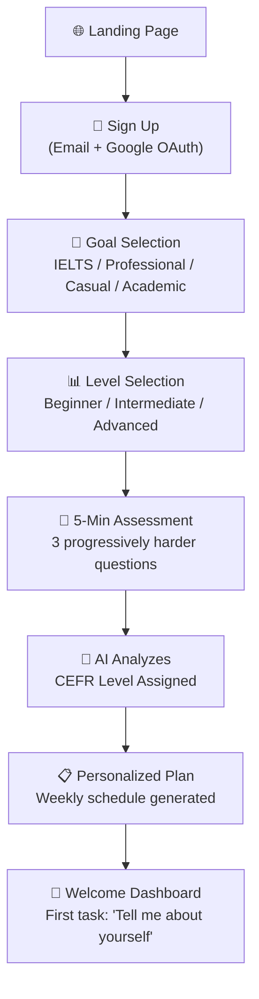
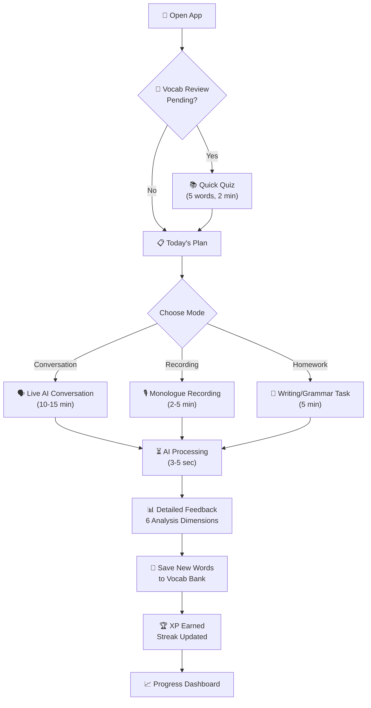
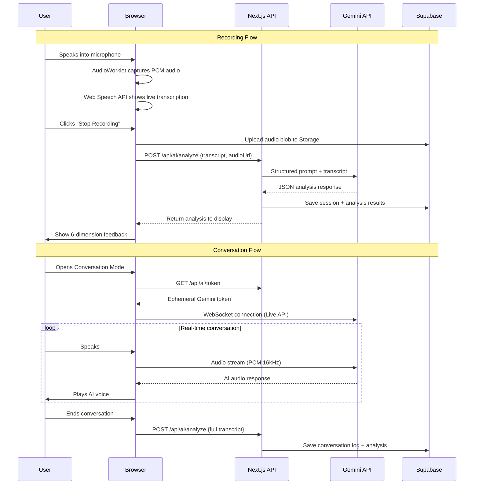
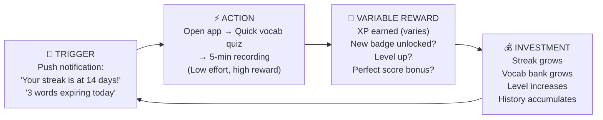

# FluentMind AI — The Ultimate Product Blueprint

> **Mission:** Replace a $30/hour human Preply tutor with a 24/7, infinitely patient, data-driven AI speaking coach that learns YOUR specific weaknesses and builds a personalized curriculum around them.

---

## Table of Contents

1. [Why Your Original Blueprint Was "Level 10"](#1-why-your-original-blueprint-was-level-10)
2. [The Preply Gap Analysis](#2-the-preply-gap-analysis)
3. [Product Vision & Philosophy](#3-product-vision--philosophy)
4. [Target Audience Personas](#4-target-audience-personas)
5. [Core Feature Modules (8 Modules)](#5-core-feature-modules)
6. [The Complete User Journey](#6-the-complete-user-journey)
7. [Technical Architecture](#7-technical-architecture)
8. [Database Schema (Complete)](#8-database-schema)
9. [AI System Design & Prompt Engineering](#9-ai-system-design--prompt-engineering)
10. [Gamification & Psychology System](#10-gamification--psychology-system)
11. [Page-by-Page UI Specification](#11-page-by-page-ui-specification)
12. [Implementation Roadmap](#12-implementation-roadmap)
13. [Open Questions for Review](#13-open-questions-for-review)

---

## 1. Why Your Original Blueprint Was "Level 10"

The original blueprint has good bones, but it treats FluentMind as a **recording tool with AI feedback**. That's a transcription app with a GPT wrapper. Here's what's missing to make it a Preply killer:

| What Preply Does | Original Blueprint | What We Need |
|---|---|---|
| **Two-way conversation** — tutor responds, asks follow-ups, challenges you | ❌ Only records monologues | ✅ Real-time AI conversation partner using Gemini Live API |
| **Pronunciation coaching** — "say that word again, stress the second syllable" | ❌ No pronunciation analysis at all | ✅ Phoneme-level pronunciation scoring |
| **Adaptive curriculum** — tutor plans next lessons based on your performance | ❌ Random topic picker | ✅ AI-generated weekly lesson plans that evolve |
| **Homework between sessions** — grammar drills, reading, writing | ❌ Nothing between sessions | ✅ Daily micro-exercises + writing tasks |
| **Emotional intelligence** — tutor knows when you're struggling | ❌ No emotional awareness | ✅ Tone/confidence analysis + adaptive difficulty |
| **Cultural fluency** — idioms, sarcasm, register, formality | ❌ Not addressed | ✅ Dedicated cultural fluency module |
| **Debate & argumentation** — tutor pushes back, makes you defend positions | ❌ Not addressed | ✅ Debate mode with AI taking opposing stance |
| **Exam-specific prep** — IELTS Part 1/2/3 simulation | ❌ Mentioned but not designed | ✅ Full mock exam engine with band scoring |
| **Session notes & accountability** — shared notes, homework tracking | ❌ Not addressed | ✅ AI-generated lesson summaries + homework system |

---

## 2. The Preply Gap Analysis

### What Makes a Preply Tutor Irreplaceable (And How We Beat Each Point)

**2.1 Accountability & Scheduling**
- Preply: You pay $30, you show up. Money = motivation.
- FluentMind: We use **streaks**, **daily commitments**, **smart notifications** ("You spoke 47% less this week. Your vocabulary bank has 12 words expiring. Come back."), and **loss aversion** (streak freezes are earned, not free).

**2.2 Real-Time Conversation**
- Preply: You talk to a human who responds naturally.
- FluentMind: We use **Gemini Live API** (WebSocket-based, real-time audio) to create a conversational AI that speaks back to you, interrupts when appropriate, asks clarifying questions, and adapts its complexity to your level. This is NOT a chatbot. This is a voice conversation.

**2.3 Personalization Over Time**
- Preply: A good tutor remembers your mistakes from 3 weeks ago.
- FluentMind: We store EVERY session, EVERY mistake, EVERY filler word, EVERY grammar error in a structured database. The AI has access to your complete learning history. It remembers better than any human.

**2.4 Emotional Support & Encouragement**
- Preply: A tutor says "great job!" and means it (sort of).
- FluentMind: We analyze **response latency** (how long you pause before answering — longer = struggling), **confidence patterns** (voice trembling, shorter sentences = nervous), and **engagement trends** (session length declining = losing interest). The AI adapts its personality accordingly.

**2.5 Cultural & Contextual Learning**
- Preply: A native speaker tutor naturally teaches idioms and cultural references.
- FluentMind: Dedicated modules for idioms, slang, register (formal vs. casual), professional jargon, and sarcasm/humor comprehension. The AI doesn't just teach words — it teaches how language **lives**.

---

## 3. Product Vision & Philosophy

### The Three Pillars

```
┌─────────────────────────────────────────────────────┐
│                   FluentMind AI                      │
│                                                      │
│   ┌──────────┐  ┌──────────┐  ┌──────────────────┐  │
│   │  SPEAK   │  │  LEARN   │  │    GROW          │  │
│   │          │  │          │  │                   │  │
│   │ Practice │  │ Analyze  │  │ Track & Level Up  │  │
│   │ Daily    │  │ Deeply   │  │ Over Months       │  │
│   └──────────┘  └──────────┘  └──────────────────┘  │
│                                                      │
│   Conversation  │  AI Engine   │  Gamification      │
│   Engine        │  + Curriculum │  + Analytics       │
└─────────────────────────────────────────────────────┘
```

### Design Philosophy
1. **"5-Minute Minimum"** — Every feature must be usable in 5 minutes or less. Low time commitment = high consistency.
2. **"Show, Don't Tell"** — The app doesn't just say "you used fillers." It highlights them in red on a transcript, plays back the exact moment, and shows a 30-day trend graph of your filler reduction.
3. **"The AI Remembers Everything"** — Unlike a human tutor who forgets, the AI has perfect recall of every session, every mistake, every strength.
4. **"Mobile-First, Always Practicing"** — Designed for the commute, the walk, the kitchen. You practice while living.

---

## 4. Target Audience Personas

### Persona 1: "Exam Prep Qasim" 🎯
- **Profile:** 25-year-old developer preparing for IELTS Academic
- **Goal:** Band 7+ in Speaking
- **Pain:** Paying $30/session on Preply, can only afford 1 session/week
- **What FluentMind gives him:** Daily IELTS Part 1/2/3 simulations, instant band score estimates, targeted vocabulary for academic topics, structural coaching (PREP/AAA frameworks)
- **Usage pattern:** 15 min/day before work, 30 min mock exam on weekends

### Persona 2: "Professional Priya" 💼
- **Profile:** 30-year-old product manager, non-native English speaker
- **Goal:** Sound confident in meetings, eliminate "um" and "like"
- **Pain:** Self-conscious during presentations, avoids speaking up
- **What FluentMind gives her:** Filler tracking with weekly reduction goals, professional vocabulary modules, mock meeting scenarios ("Present your Q3 roadmap"), confidence score based on speech patterns
- **Usage pattern:** 10 min morning warm-up, records real meetings for analysis

### Persona 3: "Student Carlos" 📚
- **Profile:** 18-year-old university freshman, B1 level English
- **Goal:** Improve conversational English for social life and academics
- **Pain:** Understands English but freezes when speaking
- **What FluentMind gives him:** Low-pressure daily conversation practice with AI, slang/idiom modules, debate practice, gradual difficulty scaling from B1 → B2
- **Usage pattern:** 20 min daily in conversation mode, vocabulary review before bed

### Persona 4: "Executive Ravi" 🏢
- **Profile:** 42-year-old CTO, fluent but unpolished
- **Goal:** Executive-level communication — persuasion, precision, impact
- **Pain:** Uses vague language, poor structure in board presentations
- **What FluentMind gives him:** Framework coaching (STAR, PREP), persuasion language modules, vocabulary precision ("good" → "compelling"), executive speaking scenarios
- **Usage pattern:** 5 min daily recording, weekly 30-min deep practice

---

## 5. Core Feature Modules

### Module A: The Live Conversation Engine 🗣️ *(THE KILLER FEATURE)*

> [!IMPORTANT]
> This is what separates FluentMind from every other "record and analyze" app. This is your Preply tutor replacement. The AI speaks back.

**How It Works:**
1. User opens the Conversation tab and selects a **scenario** (or continues a story from yesterday).
2. The app connects to **Gemini Live API** via WebSocket.
3. The AI greets the user with a natural voice: *"Hey! Yesterday we were talking about your favorite childhood memory. You mentioned your grandmother's garden. Tell me more — what did it smell like?"*
4. The user speaks. The AI listens, processes, and **responds vocally in real-time**.
5. The AI is instructed (via system prompt) to:
   - Speak at the user's CEFR level (adjusting vocabulary complexity)
   - Introduce 2-3 new vocabulary words per conversation naturally
   - Gently correct grammar mistakes inline: *"Oh, you mean you WENT to the market? Yeah, tell me more about that."*
   - Ask follow-up questions that force the user to elaborate
   - Track filler words silently (reported after the conversation ends)
   - Detect when the user is struggling and slow down or offer hints

**Scenario Categories:**
| Category | Example Scenarios |
|---|---|
| 🏠 Daily Life | "Describe your morning routine" / "What did you eat yesterday?" |
| 💼 Professional | "Explain your role to a new colleague" / "Handle a difficult client" |
| 🎭 Role-Play | "You're returning a defective product" / "Job interview for a PM role" |
| 🧠 Abstract Ideas | "Is social media good for society?" / "Should AI replace teachers?" |
| 🔥 Debate Mode | AI takes the opposing view, user must defend their position |
| 📰 Current Events | AI presents a news summary, user discusses their opinion |
| 🎲 Random Challenge | Surprise topics to test adaptability |

**Technical Implementation:**
- **API:** Gemini Live API via WebSocket (`wss://generativelanguage.googleapis.com/ws/...`)
- **Audio Input:** Browser `AudioWorklet` capturing PCM 16kHz
- **Audio Output:** AI response audio streamed back and played via `AudioContext`
- **VAD:** Voice Activity Detection handled natively by Gemini Live API (auto-detects when user stops speaking)
- **Barge-in:** User can interrupt the AI mid-sentence (natural conversation)
- **Session State:** WebSocket maintains conversation context throughout the session
- **Post-Session:** Full transcript is saved, analyzed by Gemini text API for detailed scoring

---

### Module B: The Recording Studio 🎙️ *(Monologue Practice)*

For when the user wants to practice structured speaking without a conversation partner.

**Features:**
1. **Clean Recording Interface:**
   - Large, pulsing "Record" button (animated gradient ring)
   - Real-time audio waveform visualizer (Web Audio API + Canvas)
   - Timer showing elapsed time and remaining time (if timed prompt)
   - Live transcription appearing word-by-word (Web Speech API for basic transcription, refined by Gemini post-recording)

2. **Topic System:**
   - **Daily Challenge:** AI-generated topic based on user's weak areas ("You struggle with past perfect tense. Today: Describe something you had already done before you turned 18.")
   - **Category Browser:** Grid of categories (Daily Life, Work, Travel, Technology, etc.)
   - **IELTS Cue Cards:** Full Part 2 cue card format with bullet points
   - **Custom Topic:** User types their own topic
   - **Re-Record Challenge:** "You first answered this topic 30 days ago. Try again and compare."

3. **Recording Controls:**
   - Pause/Resume (simulates natural thought-gathering)
   - Countdown Timer (configurable: 1, 2, 3, 5 minutes)
   - Preparation Time (30 seconds before recording starts, like IELTS Part 2)

4. **Native Language Toggle:**
   - User records in their native language first to organize thoughts
   - Then records again in English
   - AI compares the two transcripts and identifies where meaning was lost in translation

---

### Module C: The Evaluation Engine 🧠 *(The Brain)*

> [!NOTE]
> This module processes both conversation transcripts AND monologue recordings. All analysis is done by sending structured prompts to Gemini API and receiving JSON responses.

**Six Analysis Dimensions:**

#### C1. Filler Word Analysis ("The Clarity Score")
- **Detection:** AI identifies exact positions of: "um," "uh," "like," "you know," "basically," "literally," "actually," "I mean," "so yeah," "kind of," "sort of"
- **Contextual Awareness:** "Like" used as a simile ("It was like a waterfall") is NOT counted. Only filler usage is flagged.
- **Scoring:** `Clarity Score = 100 - (filler_count / total_words * 100 * weight_factor)`
- **Visualization:** Transcript with fillers highlighted in red, with a "filler density heatmap" showing which parts of the speech were worst
- **Trend:** 30-day line chart showing clarity score improvement

#### C2. Vocabulary & Grammar Analysis
- **Simple Word Detection:** Flags overused basic words (good, bad, big, small, very, really, thing, stuff)
- **Upgrade Suggestions:** For each flagged word, provides 3 contextual alternatives ranked by formality:
  - 🟢 Casual: "awesome" → "stellar"
  - 🟡 Professional: "awesome" → "exceptional"
  - 🔴 Academic: "awesome" → "remarkable"
- **Grammar Error Detection:**
  - Subject-verb agreement
  - Tense consistency
  - Article usage (a/an/the)
  - Preposition errors
  - Pluralization
  - Word order issues
- **Lexical Diversity Score:** Measured by Type-Token Ratio (unique words / total words)
- **CEFR Vocabulary Level:** Estimates which CEFR level your vocabulary usage corresponds to

#### C3. Structural Analysis (Framework Coaching)
- **Frameworks Available:**
  | Framework | Structure | Best For |
  |---|---|---|
  | PREP | Point → Reason → Example → Point | Opinion questions |
  | STAR | Situation → Task → Action → Result | Experience questions |
  | AAA | Answer → Add → Ask | Conversational practice |
  | PEE | Point → Evidence → Explanation | Academic/formal |
  | 3-2-1 | 3 Facts → 2 Opinions → 1 Conclusion | Debate/discussion |
  | Problem-Solution | Problem → Impact → Solution → Benefit | Professional scenarios |

- **AI Evaluation:** The AI identifies which framework (if any) the user naturally used, scores adherence, and suggests improvements
- **Visual Breakdown:** Color-coded transcript segments showing which part of the framework each sentence belongs to

#### C4. Fluency & Coherence Analysis (IELTS-Aligned)
- **Metrics:**
  - **Words Per Minute (WPM):** Calculated from audio duration and word count. Native English: 120-150 WPM. Too slow = struggling. Too fast = unclear.
  - **Pause Analysis:** Average pause length, number of pauses > 3 seconds, location of pauses (mid-sentence = bad, between ideas = natural)
  - **Self-Correction Count:** How many times the user restarted a sentence
  - **Coherence Score:** Did ideas flow logically? Were transition words used? Was there a clear beginning, middle, end?
- **IELTS Band Estimate:** Based on official band descriptors (4 criteria: Fluency & Coherence, Lexical Resource, Grammatical Range, Pronunciation)

#### C5. Pronunciation Assessment
- **Approach:** Since the Web Speech API cannot do phoneme-level analysis, we use a hybrid approach:
  - **Primary:** Gemini API is sent the audio file directly (multimodal input). The prompt asks for pronunciation assessment including commonly mispronounced words, intonation patterns, and stress errors.
  - **Secondary (Future):** Integration with Speechace API ($40/mo Basic tier) for phoneme-level scoring when budget allows.
- **What We Assess:**
  - Word-level pronunciation (did the user say the word clearly?)
  - Sentence stress (did they emphasize the right words?)
  - Intonation (did questions rise? Did statements fall?)
  - Connected speech (natural linking between words vs. robotic word-by-word delivery)
- **Feedback Format:** List of mispronounced words with audio playback of the user's attempt + a text description of how to correct it

#### C6. Emotional Tone & Confidence Analysis
- **Metrics:**
  - **Response Latency:** Time between AI's question and user's first word (longer = uncertain)
  - **Sentence Length Trend:** Sentences getting shorter over the session = fatigue/frustration
  - **Hedging Language:** "I think maybe," "perhaps," "I'm not sure but" = low confidence
  - **Assertive Language:** "I believe," "clearly," "without a doubt" = high confidence
- **Confidence Score:** 0-100, displayed as a gauge with color coding
- **AI Personality Adaptation:** If confidence is consistently low, the AI switches to a more encouraging tone. If high, the AI introduces more challenging scenarios.

---

### Module D: The Adaptive Curriculum Engine 📖 *(Your AI Teacher's Lesson Plan)*

> [!IMPORTANT]
> This is the "brain behind the brain." While Module C analyzes individual sessions, Module D looks at patterns across ALL sessions and creates a personalized learning path.

**How It Works:**

1. **Initial Assessment (Onboarding):**
   - User takes a 5-minute speaking assessment: 3 questions of increasing difficulty
   - AI evaluates and assigns initial CEFR level (A1-C2)
   - User sets goals: "IELTS Prep," "Professional Communication," "Casual Conversation," "Academic English"
   - User selects intensity: "5 min/day," "15 min/day," "30 min/day"

2. **Weekly Lesson Plan Generation:**
   Every Sunday night, the AI generates a personalized week:
   ```
   ┌──────────────────────────────────────────────────┐
   │           WEEK 12 — Lesson Plan                   │
   │                                                    │
   │  Mon: Conversation Practice — "Office Small Talk"  │
   │       Focus: Eliminating "you know" (down 40%)     │
   │       New Vocab: 3 professional greetings          │
   │                                                    │
   │  Tue: Grammar Drill — Past Perfect vs. Past Simple │
   │       You made this error 7 times last week        │
   │                                                    │
   │  Wed: Recording — IELTS Part 2 Cue Card            │
   │       Topic: "Describe a skill you learned"        │
   │       Framework Focus: STAR method                  │
   │                                                    │
   │  Thu: Vocabulary Review (Spaced Repetition Quiz)   │
   │       12 words due for review                      │
   │                                                    │
   │  Fri: Debate Mode — "Should remote work be        │
   │       mandatory?" Practice argumentation           │
   │                                                    │
   │  Sat: Free Practice — Choose your own topic        │
   │                                                    │
   │  Sun: Rest Day (or bonus challenge for extra XP)   │
   └──────────────────────────────────────────────────┘
   ```

3. **Difficulty Scaling:**
   - The AI tracks your performance across 6 dimensions over time
   - When you consistently score >85% in a dimension, difficulty increases
   - When you consistently score <60%, difficulty decreases and more practice is assigned
   - CEFR level is re-assessed monthly with a formal assessment

4. **Homework System:**
   After each session, the AI generates 2-3 micro-tasks:
   - "Write 3 sentences using 'nevertheless' in different contexts"
   - "Record yourself saying these 5 words with correct stress"
   - "Read this paragraph and summarize it in 30 seconds"

---

### Module E: The Progress & Gamification Hub 🏆

**E1. The Streak System (Psychology-Backed)**
- **Daily Goal:** User-configurable minimum (default: 5 minutes of any practice)
- **Streak Counter:** Prominent display with fire emoji animation 🔥
- **Streak Freeze:** Earned after 7 consecutive days. Max 2 freezes stored. Use one to skip a day without breaking streak.
- **Milestone Rewards:** 
  - 7 days → "Week Warrior" badge + 1 freeze
  - 30 days → "Monthly Master" badge + unlock Debate Mode
  - 100 days → "Century Speaker" badge + custom AI personality unlock
  - 365 days → "Legend" status + permanent profile badge

**E2. XP & Leveling System**

| Action | XP Earned |
|---|---|
| Complete a recording (any length) | +10 XP |
| Complete a conversation session (>3 min) | +25 XP |
| Score >90% Clarity (no fillers) | +50 XP |
| Use a saved vocabulary word in speech | +30 XP per word |
| Complete a homework task | +15 XP |
| Pass a vocabulary quiz (>80%) | +20 XP |
| Complete weekly lesson plan | +100 XP bonus |
| Improve on a re-recorded topic | +75 XP |
| Maintain a 7-day streak | +200 XP bonus |
| Win a debate (AI judges) | +150 XP |

**Leveling Tiers:**

| Level | Title | XP Required | Unlocks |
|---|---|---|---|
| 1 | Novice Communicator | 0 | Basic features |
| 2 | Emerging Speaker | 500 | Custom topics |
| 3 | Developing Communicator | 1,500 | Framework coaching |
| 4 | Confident Speaker | 4,000 | Debate mode |
| 5 | Articulate Communicator | 8,000 | Cultural fluency module |
| 6 | Persuasive Orator | 15,000 | Advanced scenarios |
| 7 | Eloquent Presenter | 25,000 | Exam simulation |
| 8 | Distinguished Speaker | 40,000 | AI personality customization |
| 9 | Master Communicator | 60,000 | All features + mentor status |
| 10 | Legendary Linguist | 100,000 | Custom badges + legacy profile |

**E3. Visual Progress Tracking**
- **Heat Map Calendar:** GitHub-style contribution graph showing daily practice activity. Darker green = more practice.
- **Skill Radar Chart:** 6-axis radar chart (Fluency, Vocabulary, Grammar, Structure, Pronunciation, Confidence) showing growth over time
- **Weekly Report Card:** AI-generated summary every Sunday: "This week you spoke for 42 minutes, learned 15 new words, and reduced fillers by 12%. Your biggest win: using the STAR framework naturally for the first time!"

---

### Module F: The Personal Vocabulary System 📚

**F1. Vocabulary Bank**
- **Adding Words:** During any evaluation, user clicks "Add to Bank" on suggested vocabulary upgrades
- **Word Entry Structure:**
  ```
  Word: "Compelling"
  Definition: Evoking interest or attention in a powerfully irresistible way
  Part of Speech: Adjective
  CEFR Level: B2
  Context: "Your argument was very compelling" (from Session #47)
  Example Sentences:
    1. "She gave a compelling presentation on climate change."
    2. "The evidence is compelling enough to change my mind."
    3. "He has a compelling personality that draws people in."
  Synonyms: Persuasive, convincing, captivating
  Audio: [pronunciation audio clip]
  Tags: #professional #argumentation #adjective
  ```

**F2. Spaced Repetition Engine (FSRS Algorithm)**
- Uses the **Free Spaced Repetition Scheduler (FSRS)** algorithm (superior to SM-2)
- Each word has a calculated `next_review_date`
- Before starting a daily session, if the user has pending reviews, they must complete a quick vocabulary quiz first
- Quiz formats rotate:
  - **Multiple Choice:** "Which word means 'evoking strong interest'?" → A) Mundane B) Compelling C) Adequate D) Modest
  - **Fill in the Blank:** "Her presentation was so _____ that the audience was silent." 
  - **Use in a Sentence:** "Record yourself using 'compelling' in a sentence." (Evaluated by AI)
  - **Reverse:** Definition shown → User speaks the word

**F3. Vocabulary Goals**
- Weekly target: Learn and retain X new words (user-configurable, default: 10)
- "Word of the Day" notification with context and usage
- Integration with Conversation Engine: AI naturally uses the user's banked words in conversation to reinforce them

---

### Module G: The Historical Dashboard 📊

**G1. Session Archive**
- Full list of all past sessions with:
  - Date, duration, type (conversation/recording)
  - Topic/scenario
  - Scores (Clarity, Vocabulary, Structure, Fluency, Pronunciation, Confidence)
  - Quick-play transcript (click to see full analysis)
- **Audio Playback:** Stream the original recording from Supabase Storage
- **Transcript View:** Full annotated transcript with color-coded highlights

**G2. Growth Charts**
- **Multi-metric Line Chart:** Track any combination of scores over 7/30/90/365 days
- **Filler Word Trend:** Specific chart showing filler word count over time (the most satisfying chart to watch decline)
- **Vocabulary Growth:** Cumulative words learned, words retained (active vs. forgotten)
- **Session Frequency:** Bar chart showing sessions per week
- **Time Invested:** Total hours of practice, by mode

**G3. Before & After Comparisons**
- App automatically identifies topics the user has recorded multiple times
- Side-by-side comparison view:
  - Left: First attempt (with scores)
  - Right: Latest attempt (with scores)
  - Delta indicators: "Clarity: +23 points 📈" / "Fillers: -67% 🎉"
- Audio comparison: Play both recordings back-to-back

**G4. AI Insights & Patterns**
- Weekly AI-generated report identifying:
  - "Your most improved area this month: Grammar (+15 points)"
  - "Recurring weakness: You still drop articles before countable nouns"
  - "Interesting pattern: Your scores are 20% higher in morning sessions"
  - "Next milestone: You're 340 XP away from Confident Speaker"

---

### Module H: Exam Preparation Engine 🎓

**H1. IELTS Speaking Simulation**
- **Part 1 (Interview):** 3-4 short questions on familiar topics (4-5 minutes)
- **Part 2 (Long Turn):** AI presents a cue card with bullet points. 1 minute preparation + 2 minutes speaking.
- **Part 3 (Discussion):** AI asks deeper, more abstract follow-up questions (4-5 minutes)
- **Scoring:** AI estimates band score (1-9) across all four official criteria:
  - Fluency & Coherence
  - Lexical Resource
  - Grammatical Range & Accuracy
  - Pronunciation
- **Detailed Feedback:** Band-specific advice ("To move from 6.5 to 7.0, you need to reduce self-corrections and use more idiomatic language")

**H2. TOEFL Speaking Simulation**
- Independent tasks (express opinion on topic)
- Integrated tasks (read passage → listen to lecture → speak)
- Score estimate (0-30 scale)

**H3. General Assessment**
- Monthly CEFR level check (A1-C2)
- Downloadable progress certificate (PDF)
- Historical CEFR progression chart

---

## 6. The Complete User Journey

### First-Time Experience (Day 1)



### Daily Experience (Day 30+)



---

## 7. Technical Architecture

### Stack Overview

```
┌─────────────────────────────────────────────────────────────┐
│                        FRONTEND                              │
│                                                              │
│   Next.js 14+ (App Router)                                   │
│   ├── React 18+ (UI Components)                              │
│   ├── TypeScript (Type Safety)                               │
│   ├── Zustand (Client State Management)                      │
│   ├── Framer Motion (Animations)                             │
│   ├── Recharts (Charts & Graphs)                             │
│   ├── Web Audio API (Waveform Visualization)                 │
│   ├── AudioWorklet (Audio Capture for Gemini Live)           │
│   └── CSS Modules + CSS Variables (Styling)                  │
│                                                              │
├──────────────────────────────────────────────────────────────┤
│                        BACKEND                               │
│                                                              │
│   Next.js API Routes (Server-Side)                           │
│   ├── /api/ai/analyze — Send transcript to Gemini            │
│   ├── /api/ai/generate-plan — Weekly lesson plan             │
│   ├── /api/ai/generate-topic — Context-aware topic           │
│   ├── /api/ai/token — Ephemeral token for Live API           │
│   ├── /api/sessions — CRUD for practice sessions             │
│   ├── /api/vocabulary — Vocabulary bank operations           │
│   ├── /api/progress — XP, streaks, levels                    │
│   ├── /api/homework — Homework generation & grading          │
│   └── /api/exam — Mock exam engine                           │
│                                                              │
├──────────────────────────────────────────────────────────────┤
│                        AI LAYER                              │
│                                                              │
│   Gemini API (Google AI)                                     │
│   ├── Gemini Live API (WebSocket) — Real-time conversation   │
│   ├── Gemini 2.5 Flash (Text) — Fast analysis & scoring      │
│   ├── Gemini 2.5 Pro (Text) — Deep analysis & curriculum     │
│   └── Gemini Multimodal — Audio file pronunciation analysis  │
│                                                              │
├──────────────────────────────────────────────────────────────┤
│                     PERSISTENCE                              │
│                                                              │
│   Supabase                                                   │
│   ├── PostgreSQL — All structured data                       │
│   ├── Auth — Email/Password + Google OAuth + Magic Link      │
│   ├── Storage — Audio recordings (organized by user/date)    │
│   ├── Row Level Security — User data isolation               │
│   ├── Edge Functions — Cron jobs (weekly plan generation)    │
│   └── Realtime — Live updates for session processing status  │
│                                                              │
└─────────────────────────────────────────────────────────────┘
```

### Key Architectural Decisions

| Decision | Choice | Rationale |
|---|---|---|
| **Framework** | Next.js 14+ App Router | SSR for SEO, API routes for backend, great DX |
| **Database** | Supabase (PostgreSQL) | Free tier generous, built-in auth, storage, real-time |
| **AI Provider** | Google Gemini | Free tier (15 RPM), Live API for real-time voice, multimodal |
| **State Management** | Zustand | Lightweight, no boilerplate, perfect for client state |
| **Audio Capture** | AudioWorklet + Web Audio API | Low-latency, browser-native, no dependencies |
| **Charts** | Recharts | React-native, responsive, great for line/radar/bar charts |
| **Animations** | Framer Motion | Smooth, declarative animations for UI polish |
| **Deployment** | Vercel | Free tier, optimized for Next.js, edge functions |

### Data Flow Architecture



---

## 8. Database Schema

> [!NOTE]
> All tables use Supabase's built-in UUID generation, timestamps, and Row Level Security (RLS). Every table has `user_id` with a foreign key to `auth.users` and RLS policies ensuring users can only access their own data.

### Core Tables

#### `profiles`
```sql
CREATE TABLE profiles (
  id UUID PRIMARY KEY REFERENCES auth.users(id) ON DELETE CASCADE,
  display_name TEXT,
  avatar_url TEXT,
  native_language TEXT DEFAULT 'English',
  target_language TEXT DEFAULT 'English',
  current_cefr_level TEXT DEFAULT 'B1', -- A1, A2, B1, B2, C1, C2
  goal TEXT DEFAULT 'casual', -- 'ielts', 'professional', 'casual', 'academic'
  daily_goal_minutes INTEGER DEFAULT 5,
  intensity TEXT DEFAULT 'moderate', -- 'light', 'moderate', 'intense'
  onboarding_completed BOOLEAN DEFAULT false,
  timezone TEXT DEFAULT 'UTC',
  created_at TIMESTAMPTZ DEFAULT NOW(),
  updated_at TIMESTAMPTZ DEFAULT NOW()
);
```

#### `sessions`
```sql
CREATE TABLE sessions (
  id UUID PRIMARY KEY DEFAULT gen_random_uuid(),
  user_id UUID REFERENCES auth.users(id) ON DELETE CASCADE,
  session_type TEXT NOT NULL, -- 'recording', 'conversation', 'exam', 'homework'
  topic_id UUID REFERENCES topics(id),
  topic_text TEXT, -- The actual prompt/topic text
  scenario_category TEXT, -- 'daily_life', 'professional', 'role_play', etc.
  duration_seconds INTEGER,
  audio_url TEXT, -- Supabase Storage path
  transcript TEXT,
  native_transcript TEXT, -- If native language toggle was used
  
  -- Scores (0-100)
  clarity_score INTEGER,
  vocabulary_score INTEGER,
  grammar_score INTEGER,
  structure_score INTEGER,
  fluency_score INTEGER,
  pronunciation_score INTEGER,
  confidence_score INTEGER,
  overall_score INTEGER,
  
  -- IELTS-specific (if exam mode)
  ielts_fluency_band DECIMAL(2,1),
  ielts_lexical_band DECIMAL(2,1),
  ielts_grammar_band DECIMAL(2,1),
  ielts_pronunciation_band DECIMAL(2,1),
  ielts_overall_band DECIMAL(2,1),
  
  -- Metadata
  words_per_minute DECIMAL(5,1),
  total_words INTEGER,
  unique_words INTEGER,
  filler_count INTEGER,
  self_correction_count INTEGER,
  average_pause_seconds DECIMAL(4,2),
  framework_used TEXT, -- 'PREP', 'STAR', 'AAA', etc.
  framework_adherence_score INTEGER,
  
  -- AI Analysis (stored as JSON)
  analysis_json JSONB, -- Full AI response
  fillers_detail JSONB, -- [{word: "um", positions: [12, 45, 78], count: 3}]
  vocabulary_suggestions JSONB, -- [{original: "good", suggestions: [...], context: "..."}]
  grammar_errors JSONB, -- [{error: "...", correction: "...", rule: "...", position: 23}]
  structure_feedback JSONB, -- {framework: "PREP", segments: [...], missing: [...]}
  pronunciation_feedback JSONB, -- [{word: "...", issue: "...", tip: "..."}]
  
  -- XP earned from this session
  xp_earned INTEGER DEFAULT 0,
  
  created_at TIMESTAMPTZ DEFAULT NOW()
);
```

#### `conversation_messages`
```sql
CREATE TABLE conversation_messages (
  id UUID PRIMARY KEY DEFAULT gen_random_uuid(),
  session_id UUID REFERENCES sessions(id) ON DELETE CASCADE,
  user_id UUID REFERENCES auth.users(id) ON DELETE CASCADE,
  role TEXT NOT NULL, -- 'user', 'ai'
  content TEXT NOT NULL, -- Transcribed text
  audio_url TEXT, -- Optional: audio clip of this specific turn
  timestamp_ms INTEGER, -- Milliseconds from session start
  metadata JSONB, -- Any additional data (corrections made, vocab introduced)
  created_at TIMESTAMPTZ DEFAULT NOW()
);
```

#### `topics`
```sql
CREATE TABLE topics (
  id UUID PRIMARY KEY DEFAULT gen_random_uuid(),
  category TEXT NOT NULL, -- 'daily_life', 'professional', 'abstract', 'ielts_part1', etc.
  subcategory TEXT,
  title TEXT NOT NULL,
  prompt_text TEXT NOT NULL,
  cue_card_points JSONB, -- For IELTS Part 2: ["What it is", "When you did it", "Why you liked it"]
  difficulty_level TEXT DEFAULT 'intermediate', -- 'beginner', 'intermediate', 'advanced'
  cefr_level TEXT DEFAULT 'B1',
  suggested_framework TEXT, -- 'PREP', 'STAR', etc.
  suggested_duration_seconds INTEGER DEFAULT 120,
  tags TEXT[],
  is_daily_challenge BOOLEAN DEFAULT false,
  is_ai_generated BOOLEAN DEFAULT false,
  created_at TIMESTAMPTZ DEFAULT NOW()
);
```

#### `vocabulary_bank`
```sql
CREATE TABLE vocabulary_bank (
  id UUID PRIMARY KEY DEFAULT gen_random_uuid(),
  user_id UUID REFERENCES auth.users(id) ON DELETE CASCADE,
  word TEXT NOT NULL,
  definition TEXT NOT NULL,
  part_of_speech TEXT, -- 'noun', 'verb', 'adjective', etc.
  cefr_level TEXT,
  context_sentence TEXT, -- The sentence where it was first encountered
  example_sentences JSONB, -- ["sentence1", "sentence2", "sentence3"]
  synonyms TEXT[],
  antonyms TEXT[],
  pronunciation_guide TEXT,
  audio_url TEXT, -- Pronunciation audio
  tags TEXT[],
  source_session_id UUID REFERENCES sessions(id),
  
  -- Spaced Repetition Fields (FSRS)
  stability DECIMAL(8,4) DEFAULT 0,
  difficulty DECIMAL(8,4) DEFAULT 0,
  elapsed_days INTEGER DEFAULT 0,
  scheduled_days INTEGER DEFAULT 0,
  reps INTEGER DEFAULT 0,
  lapses INTEGER DEFAULT 0,
  state TEXT DEFAULT 'new', -- 'new', 'learning', 'review', 'relearning'
  next_review_date TIMESTAMPTZ DEFAULT NOW(),
  last_review_date TIMESTAMPTZ,
  
  -- Usage tracking
  times_used_in_speech INTEGER DEFAULT 0,
  mastery_level TEXT DEFAULT 'new', -- 'new', 'learning', 'familiar', 'mastered'
  
  created_at TIMESTAMPTZ DEFAULT NOW(),
  updated_at TIMESTAMPTZ DEFAULT NOW()
);
```

#### `vocabulary_reviews`
```sql
CREATE TABLE vocabulary_reviews (
  id UUID PRIMARY KEY DEFAULT gen_random_uuid(),
  user_id UUID REFERENCES auth.users(id) ON DELETE CASCADE,
  vocabulary_id UUID REFERENCES vocabulary_bank(id) ON DELETE CASCADE,
  review_type TEXT NOT NULL, -- 'multiple_choice', 'fill_blank', 'speak', 'reverse'
  quality INTEGER NOT NULL, -- 0-5 (FSRS rating: Again=1, Hard=2, Good=3, Easy=4)
  response_time_ms INTEGER, -- How long the user took
  was_correct BOOLEAN,
  user_answer TEXT,
  created_at TIMESTAMPTZ DEFAULT NOW()
);
```

### Progress & Gamification Tables

#### `user_progress`
```sql
CREATE TABLE user_progress (
  id UUID PRIMARY KEY DEFAULT gen_random_uuid(),
  user_id UUID REFERENCES auth.users(id) ON DELETE CASCADE UNIQUE,
  total_xp INTEGER DEFAULT 0,
  current_level INTEGER DEFAULT 1,
  current_level_title TEXT DEFAULT 'Novice Communicator',
  
  -- Streak
  current_streak INTEGER DEFAULT 0,
  longest_streak INTEGER DEFAULT 0,
  streak_freezes_available INTEGER DEFAULT 0,
  last_practice_date DATE,
  streak_freeze_used_today BOOLEAN DEFAULT false,
  
  -- Cumulative stats
  total_sessions INTEGER DEFAULT 0,
  total_practice_minutes INTEGER DEFAULT 0,
  total_words_spoken INTEGER DEFAULT 0,
  total_vocabulary_learned INTEGER DEFAULT 0,
  total_vocabulary_mastered INTEGER DEFAULT 0,
  total_conversations INTEGER DEFAULT 0,
  total_recordings INTEGER DEFAULT 0,
  total_exams_taken INTEGER DEFAULT 0,
  total_homework_completed INTEGER DEFAULT 0,
  
  -- Best scores
  best_clarity_score INTEGER DEFAULT 0,
  best_overall_score INTEGER DEFAULT 0,
  best_ielts_band DECIMAL(2,1),
  
  -- Current assessment
  assessed_cefr_level TEXT DEFAULT 'B1',
  last_assessment_date TIMESTAMPTZ,
  
  updated_at TIMESTAMPTZ DEFAULT NOW()
);
```

#### `daily_activity`
```sql
CREATE TABLE daily_activity (
  id UUID PRIMARY KEY DEFAULT gen_random_uuid(),
  user_id UUID REFERENCES auth.users(id) ON DELETE CASCADE,
  activity_date DATE NOT NULL DEFAULT CURRENT_DATE,
  practice_minutes INTEGER DEFAULT 0,
  sessions_completed INTEGER DEFAULT 0,
  xp_earned INTEGER DEFAULT 0,
  words_learned INTEGER DEFAULT 0,
  homework_completed INTEGER DEFAULT 0,
  daily_goal_met BOOLEAN DEFAULT false,
  
  UNIQUE(user_id, activity_date)
);
```

#### `badges`
```sql
CREATE TABLE badges (
  id UUID PRIMARY KEY DEFAULT gen_random_uuid(),
  name TEXT NOT NULL,
  description TEXT NOT NULL,
  icon_url TEXT,
  category TEXT, -- 'streak', 'skill', 'milestone', 'special'
  requirement_type TEXT, -- 'streak_days', 'total_sessions', 'score_threshold', etc.
  requirement_value INTEGER,
  xp_reward INTEGER DEFAULT 0,
  created_at TIMESTAMPTZ DEFAULT NOW()
);

CREATE TABLE user_badges (
  id UUID PRIMARY KEY DEFAULT gen_random_uuid(),
  user_id UUID REFERENCES auth.users(id) ON DELETE CASCADE,
  badge_id UUID REFERENCES badges(id),
  earned_at TIMESTAMPTZ DEFAULT NOW(),
  
  UNIQUE(user_id, badge_id)
);
```

### Curriculum Tables

#### `lesson_plans`
```sql
CREATE TABLE lesson_plans (
  id UUID PRIMARY KEY DEFAULT gen_random_uuid(),
  user_id UUID REFERENCES auth.users(id) ON DELETE CASCADE,
  week_start_date DATE NOT NULL,
  week_end_date DATE NOT NULL,
  plan_json JSONB NOT NULL, -- Full weekly plan structure
  focus_areas TEXT[], -- ['filler_reduction', 'past_tense', 'vocabulary_expansion']
  is_completed BOOLEAN DEFAULT false,
  completion_percentage INTEGER DEFAULT 0,
  created_at TIMESTAMPTZ DEFAULT NOW()
);
```

#### `lesson_plan_tasks`
```sql
CREATE TABLE lesson_plan_tasks (
  id UUID PRIMARY KEY DEFAULT gen_random_uuid(),
  lesson_plan_id UUID REFERENCES lesson_plans(id) ON DELETE CASCADE,
  user_id UUID REFERENCES auth.users(id) ON DELETE CASCADE,
  day_of_week INTEGER NOT NULL, -- 1=Monday, 7=Sunday
  task_type TEXT NOT NULL, -- 'conversation', 'recording', 'grammar_drill', 'vocab_review', 'debate', 'free_practice', 'exam_sim', 'homework'
  task_title TEXT NOT NULL,
  task_description TEXT,
  focus_skill TEXT, -- 'fluency', 'vocabulary', 'grammar', 'structure', 'pronunciation'
  topic_id UUID REFERENCES topics(id),
  estimated_minutes INTEGER DEFAULT 10,
  is_completed BOOLEAN DEFAULT false,
  completed_session_id UUID REFERENCES sessions(id),
  sort_order INTEGER DEFAULT 0,
  created_at TIMESTAMPTZ DEFAULT NOW()
);
```

#### `homework`
```sql
CREATE TABLE homework (
  id UUID PRIMARY KEY DEFAULT gen_random_uuid(),
  user_id UUID REFERENCES auth.users(id) ON DELETE CASCADE,
  session_id UUID REFERENCES sessions(id), -- The session that generated this homework
  task_type TEXT NOT NULL, -- 'write_sentences', 'pronunciation_practice', 'reading_summary', 'grammar_exercise'
  instructions TEXT NOT NULL,
  content JSONB, -- Task-specific content
  user_response TEXT, -- User's submission
  ai_feedback TEXT, -- AI grading
  score INTEGER, -- 0-100
  is_completed BOOLEAN DEFAULT false,
  due_date DATE,
  xp_reward INTEGER DEFAULT 15,
  created_at TIMESTAMPTZ DEFAULT NOW(),
  completed_at TIMESTAMPTZ
);
```

### Error Pattern Tracking

#### `error_patterns`
```sql
CREATE TABLE error_patterns (
  id UUID PRIMARY KEY DEFAULT gen_random_uuid(),
  user_id UUID REFERENCES auth.users(id) ON DELETE CASCADE,
  error_type TEXT NOT NULL, -- 'grammar', 'vocabulary', 'filler', 'pronunciation', 'structure'
  error_subtype TEXT, -- 'missing_article', 'wrong_tense', 'subject_verb_agreement'
  description TEXT NOT NULL,
  example_text TEXT,
  correction TEXT,
  occurrence_count INTEGER DEFAULT 1,
  first_seen_at TIMESTAMPTZ DEFAULT NOW(),
  last_seen_at TIMESTAMPTZ DEFAULT NOW(),
  is_resolved BOOLEAN DEFAULT false,
  resolved_at TIMESTAMPTZ
);
```

### Settings & Preferences

#### `user_settings`
```sql
CREATE TABLE user_settings (
  id UUID PRIMARY KEY DEFAULT gen_random_uuid(),
  user_id UUID REFERENCES auth.users(id) ON DELETE CASCADE UNIQUE,
  
  -- AI Personality
  ai_personality TEXT DEFAULT 'encouraging', -- 'encouraging', 'strict', 'casual', 'professional'
  ai_voice TEXT DEFAULT 'default', -- Voice selection for Gemini Live
  
  -- Notification Preferences
  daily_reminder_enabled BOOLEAN DEFAULT true,
  daily_reminder_time TIME DEFAULT '09:00',
  streak_warning_enabled BOOLEAN DEFAULT true,
  weekly_report_enabled BOOLEAN DEFAULT true,
  
  -- Practice Preferences
  default_recording_duration INTEGER DEFAULT 120, -- seconds
  show_live_transcription BOOLEAN DEFAULT true,
  auto_play_pronunciation BOOLEAN DEFAULT true,
  preparation_time_enabled BOOLEAN DEFAULT true,
  preparation_time_seconds INTEGER DEFAULT 30,
  
  -- Privacy
  store_audio_recordings BOOLEAN DEFAULT true,
  share_progress_publicly BOOLEAN DEFAULT false,
  
  -- Display
  theme TEXT DEFAULT 'dark', -- 'light', 'dark', 'system'
  
  created_at TIMESTAMPTZ DEFAULT NOW(),
  updated_at TIMESTAMPTZ DEFAULT NOW()
);
```

---

## 9. AI System Design & Prompt Engineering

### Prompt Architecture

All AI interactions use **structured JSON prompts** with strict output formatting to ensure the frontend can reliably parse and display results.

### Master Analysis Prompt (Sent after each recording/conversation)

```
You are FluentMind AI, an expert English speaking coach and linguist. 
You are analyzing a speech transcript from a CEFR {user_cefr_level} level student 
whose goal is {user_goal}.

STUDENT CONTEXT:
- Native language: {native_language}
- Current CEFR level: {cefr_level}
- Recurring error patterns: {recent_error_patterns}
- Vocabulary bank size: {vocab_count} words
- Days practicing: {streak_count}
- Focus areas this week: {weekly_focus}

TRANSCRIPT:
"{transcript}"

TOPIC/PROMPT:
"{topic_text}"

SESSION TYPE: {session_type} (recording/conversation)
DURATION: {duration_seconds} seconds
WORD COUNT: {word_count}

Analyze this transcript across ALL six dimensions and return STRICTLY this JSON:

{
  "clarity": {
    "score": 0-100,
    "filler_words": [
      {"word": "string", "positions": [int], "count": int}
    ],
    "total_fillers": int,
    "filler_ratio": float,
    "feedback": "string (2-3 sentences, encouraging but specific)"
  },
  "vocabulary": {
    "score": 0-100,
    "lexical_diversity": float (type-token ratio),
    "cefr_vocabulary_level": "A1-C2",
    "basic_words_flagged": [
      {
        "original": "string",
        "context": "string (the surrounding sentence)",
        "suggestions": [
          {"word": "string", "register": "casual/professional/academic", "definition": "string"}
        ]
      }
    ],
    "advanced_words_used": ["string"],
    "feedback": "string"
  },
  "grammar": {
    "score": 0-100,
    "errors": [
      {
        "original_text": "string",
        "corrected_text": "string",
        "error_type": "string (article/tense/agreement/preposition/word_order/other)",
        "explanation": "string",
        "position_in_transcript": int
      }
    ],
    "patterns_noticed": ["string"],
    "feedback": "string"
  },
  "structure": {
    "score": 0-100,
    "framework_detected": "PREP/STAR/AAA/PEE/none",
    "framework_adherence": {
      "segments": [
        {"label": "Point/Situation/Answer/etc.", "text": "string", "present": bool}
      ],
      "missing_elements": ["string"]
    },
    "coherence_score": 0-100,
    "transition_words_used": ["string"],
    "feedback": "string",
    "suggested_framework": "string"
  },
  "fluency": {
    "score": 0-100,
    "words_per_minute": float,
    "estimated_pause_count": int,
    "self_correction_count": int,
    "ielts_band_estimate": float (0.0-9.0, in 0.5 increments),
    "feedback": "string"
  },
  "pronunciation": {
    "score": 0-100,
    "problem_words": [
      {"word": "string", "issue": "string", "tip": "string"}
    ],
    "intonation_feedback": "string",
    "stress_feedback": "string",
    "feedback": "string"
  },
  "confidence": {
    "score": 0-100,
    "hedging_phrases": ["string"],
    "assertive_phrases": ["string"],
    "feedback": "string"
  },
  "overall": {
    "score": 0-100,
    "summary": "string (3-4 sentence encouraging summary)",
    "top_strength": "string",
    "top_weakness": "string",
    "actionable_tip": "string (ONE specific thing to practice next)"
  },
  "homework": [
    {
      "type": "write_sentences/pronunciation_practice/grammar_exercise",
      "instruction": "string",
      "content": {}
    }
  ]
}

RULES:
1. Be encouraging but honest. Never sugar-coat, but always end with positivity.
2. Scores must reflect actual performance. A score of 90+ means genuinely excellent.
3. Consider the user's CEFR level. A B1 student using B2 vocabulary deserves praise.
4. Flag CONTEXTUAL filler words only. "Like" as a simile is NOT a filler.
5. Grammar errors must include the exact original and corrected text.
6. The homework should target the user's WEAKEST dimension from this session.
```

### Conversation System Prompt (For Gemini Live API)

```
You are a natural, warm, and intelligent English speaking coach called "Mind" 
(short for FluentMind). You are having a real conversation with a student.

STUDENT PROFILE:
- Name: {display_name}
- CEFR Level: {cefr_level}
- Goal: {goal}
- Native Language: {native_language}
- Recurring mistakes: {error_patterns}
- Vocabulary to reinforce: {recent_vocab_words}
- Today's focus: {daily_focus}

CONVERSATION RULES:
1. Speak at the student's CEFR level. If they're B1, don't use C2 vocabulary freely.
2. Naturally introduce 2-3 new vocabulary words per conversation. When you use one, 
   briefly explain it: "That situation sounds quite daunting — meaning scary or 
   intimidating. Has anything like that happened before?"
3. When the student makes a grammar error, correct it NATURALLY within your response, 
   not as a teacher correcting — but as a friend who models correct language. 
   Example: Student says "I go to market yesterday." You say: "Oh, you WENT to the 
   market yesterday? What did you buy?"
4. Ask follow-up questions that require the student to elaborate. Don't accept 
   one-sentence answers.
5. If the student is struggling (long pauses, very short answers), offer hints or 
   simplify your language.
6. If the student is doing well, gradually increase complexity.
7. Track filler words silently (don't interrupt for fillers during conversation).
8. Be warm, curious, and occasionally funny. You're a friendly coach, not a strict 
   teacher.
9. Use the student's vocabulary bank words naturally in conversation to reinforce them.
10. At the end of the conversation, summarize what was discussed and highlight 
    2-3 things they did well.

SCENARIO: {scenario_description}
```

### Weekly Plan Generation Prompt

```
You are the curriculum director for FluentMind AI. Based on the student's 
performance data from the past week, generate a personalized weekly lesson plan.

STUDENT DATA:
- CEFR Level: {cefr_level}
- Goal: {goal}
- Daily commitment: {daily_goal_minutes} minutes
- Last week's average scores:
  Clarity: {avg_clarity}, Vocabulary: {avg_vocab}, Grammar: {avg_grammar}
  Structure: {avg_structure}, Fluency: {avg_fluency}, Pronunciation: {avg_pronunciation}
- Recurring error patterns: {error_patterns}
- Vocabulary bank size: {vocab_count}, Words due for review: {vocab_due_count}
- Current streak: {streak_days} days
- Topics already covered this month: {covered_topics}
- Weakest area: {weakest_dimension}
- Strongest area: {strongest_dimension}

Generate a 7-day lesson plan as JSON. Each day should have 1-2 tasks that fit 
within {daily_goal_minutes} minutes. Focus 40% of tasks on the weakest area, 
30% on maintaining strengths, and 30% on variety/fun to prevent burnout.

Return JSON in this format:
{
  "week_summary": "string",
  "focus_areas": ["string"],
  "days": [
    {
      "day": 1, // 1=Monday
      "tasks": [
        {
          "type": "conversation/recording/grammar_drill/vocab_review/debate/exam_sim/homework",
          "title": "string",
          "description": "string",
          "focus_skill": "string",
          "estimated_minutes": int,
          "topic": {
            "category": "string",
            "prompt": "string",
            "suggested_framework": "string"
          }
        }
      ]
    }
  ]
}
```

---

## 10. Gamification & Psychology System

### The Hook Model (Applied to FluentMind)



### Loss Aversion Mechanics
- **Streak Loss Warning:** "⚠️ You haven't practiced today. Your 14-day streak expires at midnight!"
- **Vocabulary Decay:** Words not reviewed on schedule "fade" visually in the bank (greyed out). If not reviewed within 3x the scheduled interval, they reset to "learning" state.
- **Streak Freeze Scarcity:** Max 2 freezes at any time. Earned by completing 7 consecutive days. Creates genuine value.

### Social Proof (Future Enhancement)
- Anonymous leaderboards by CEFR level
- "X people improved their clarity score by 20+ points this week"
- Shared milestones: "Qasim just reached Confident Speaker level! 🎉"

### Achievement Psychology
Every badge/level has three motivational properties:
1. **Earned, not given:** Must meet specific criteria
2. **Visible:** Displayable on profile
3. **Progressive:** Each one is harder than the last

---

## 11. Page-by-Page UI Specification

### Page Map

```
/                          → Landing Page (public)
/login                     → Authentication
/signup                    → Registration
/onboarding                → Initial assessment flow
/onboarding/assessment     → Speaking assessment
/dashboard                 → Daily dashboard (main view)
/practice/record           → Recording studio
/practice/conversation     → Live AI conversation
/practice/debate           → Debate mode
/evaluation/[sessionId]    → Session evaluation results
/vocabulary                → Vocabulary bank
/vocabulary/review         → Spaced repetition quiz
/progress                  → Progress hub (charts, streaks, badges)
/history                   → Session archive
/history/[sessionId]       → Historical session detail
/curriculum                → Weekly lesson plan
/homework                  → Homework tasks
/homework/[homeworkId]     → Individual homework task
/exam                      → Exam center
/exam/ielts                → IELTS simulation
/exam/assessment           → CEFR assessment
/settings                  → User settings & preferences
/profile                   → User profile & badges
```

### Key Screen Specifications

#### Dashboard (`/dashboard`)
The nerve center. The user sees this every time they open the app:
- **Top Bar:** Streak counter (🔥14), XP bar (2,450/4,000 to next level), Quick Settings
- **Today's Plan Card:** Shows the current day's task from the weekly plan, with a big CTA button "Start Today's Task"
- **Vocab Alert:** If words are due for review, a banner says "📚 5 words need review before you start"
- **Quick Stats Row:** Sessions this week, Practice minutes today, Current clarity score
- **Recent Session:** Card showing last session with scores at a glance
- **Motivation Quote:** AI-generated based on progress: "You're 2 days from your longest streak ever!"

#### Recording Studio (`/practice/record`)
- **Background:** Dark, immersive, minimal distractions
- **Center:** Large circular Record button with animated gradient ring (idle: slow pulse, recording: active waveform)
- **Above Button:** Topic card with prompt text, category badge, suggested framework, timer
- **Below Button:** Real-time transcript appearing word by word
- **Controls:** Pause/Resume, Stop, Restart, Timer display
- **Sidebar (collapsed by default):** Topic picker, preparation time toggle, native language toggle

#### Evaluation (`/evaluation/[sessionId]`)
- **Hero:** Overall score circle (0-100) with animated fill
- **Tab Navigation:** 6 tabs for each analysis dimension
  - 📊 Clarity | 📚 Vocabulary | ✏️ Grammar | 🏗️ Structure | 🗣️ Fluency | 💪 Confidence
- **Each Tab Contains:**
  - Score gauge (animated)
  - Detailed feedback text
  - Interactive transcript with highlights (click a highlight to see the detail)
  - Actionable suggestions
  - "Add to Vocab Bank" buttons on vocabulary suggestions
- **Bottom:** Homework generated, XP earned, streak update

#### Conversation Mode (`/practice/conversation`)
- **Full-screen immersive experience**
- **Center:** Large animated orb that reacts to both user's and AI's voice (pulsing, color-shifting)
- **Bottom:** Live transcript of the conversation (scrolling)
- **Top:** Timer, scenario name, "End Conversation" button
- **No distracting UI** — this is about immersion
- **Post-conversation:** Smooth transition to evaluation screen

#### Vocabulary Bank (`/vocabulary`)
- **Grid/List toggle** showing all banked words
- **Each word card:** Word, definition, CEFR level, mastery badge (🟢 mastered / 🟡 learning / 🔴 new), next review date
- **Search & filter** by CEFR level, mastery status, tag, date added
- **Quick action:** Practice this word, Remove from bank
- **Stats bar:** Total words, Mastered %, Due for review today

#### Progress Hub (`/progress`)
- **Streak Calendar:** Full-year heat map
- **Skill Radar Chart:** 6-axis, with toggle to show last week vs. now
- **Growth Lines:** Multi-metric trend charts with time range selector
- **Badge Collection:** Grid of earned badges (locked badges shown as silhouettes)
- **Level Progress:** XP bar with next milestone
- **Weekly Report:** Expandable AI-generated summary

---

## 12. Implementation Roadmap

### Phase 1: Foundation (Weeks 1-2)
- [ ] Initialize Next.js project with TypeScript
- [ ] Set up Supabase project (auth, database, storage)
- [ ] Create complete database schema (all tables)
- [ ] Build authentication flow (Email + Google OAuth)
- [ ] Design system: colors, typography, components
- [ ] Landing page
- [ ] Basic layout (sidebar navigation, responsive)

### Phase 2: Core Recording Flow (Weeks 3-4)
- [ ] Recording Studio UI (waveform, timer, controls)
- [ ] Audio capture and storage (Web Audio API → Supabase Storage)
- [ ] Live transcription (Web Speech API)
- [ ] Topic system (categories, daily challenge, random)
- [ ] Gemini API integration (analysis prompt)
- [ ] Evaluation results page (all 6 tabs)
- [ ] Session storage in database

### Phase 3: Vocabulary & Progress (Weeks 5-6)
- [ ] Vocabulary Bank CRUD
- [ ] FSRS spaced repetition engine
- [ ] Vocabulary review quiz (4 formats)
- [ ] XP and leveling system
- [ ] Streak tracking
- [ ] Daily activity logging
- [ ] Badge system
- [ ] Progress dashboard (charts, heat map)

### Phase 4: Live Conversation Engine (Weeks 7-8)
- [ ] Gemini Live API WebSocket integration
- [ ] Audio capture pipeline (AudioWorklet → PCM → WebSocket)
- [ ] Audio playback pipeline (WebSocket → AudioContext)
- [ ] Conversation UI (immersive orb, live transcript)
- [ ] Scenario system
- [ ] Post-conversation analysis
- [ ] Conversation message storage

### Phase 5: Curriculum & Intelligence (Weeks 9-10)
- [ ] Onboarding assessment flow
- [ ] Weekly lesson plan generation
- [ ] Lesson plan UI (weekly view, task cards)
- [ ] Homework system (generation, submission, grading)
- [ ] Error pattern tracking
- [ ] Adaptive difficulty engine
- [ ] AI personality settings

### Phase 6: Exam & Advanced Features (Weeks 11-12)
- [ ] IELTS simulation (Part 1, 2, 3)
- [ ] IELTS band scoring
- [ ] CEFR assessment
- [ ] Historical dashboard (archives, before/after)
- [ ] Debate mode
- [ ] Native language toggle & comparison
- [ ] Settings page (all preferences)

### Phase 7: Polish & Launch (Weeks 13-14)
- [ ] Mobile responsive optimization
- [ ] Performance optimization (audio loading, API call batching)
- [ ] SEO (landing page)
- [ ] Error handling & edge cases
- [ ] Tutorial/onboarding tooltips
- [ ] Notification system
- [ ] Final QA testing
- [ ] Deploy to Vercel

---

## 13. Open Questions for Review

> [!IMPORTANT]
> **Question 1: Gemini Live API Access**
> The Gemini Live API is the core of the conversation feature. We need to verify that your Google AI Studio account has access to it. The free tier may have strict rate limits (5-15 RPM). For MVP, should we start with a text-based chatbot conversation (user types/speaks, AI responds with text) and upgrade to voice conversation later?

> [!IMPORTANT]
> **Question 2: Audio Storage vs. Transcript Only**
> Storing audio files in Supabase Storage uses space (free tier: 1GB). Should we:
> - A) Store all audio recordings (best for pronunciation review and before/after comparison)
> - B) Store only transcripts (saves space, lose pronunciation review capability)
> - C) Store audio for 30 days then auto-delete (compromise)

> [!WARNING]
> **Question 3: Pronunciation Assessment**
> Professional pronunciation APIs (Speechace: $40/mo) give phoneme-level scoring. The free alternative is sending audio to Gemini's multimodal API for general pronunciation feedback. This won't be as precise as ELSA Speak, but it's good enough for an MVP. Is this acceptable for Phase 1?

> [!IMPORTANT]
> **Question 4: Scope for MVP**
> This blueprint is comprehensive (14 weeks). For a faster launch, we could cut Phase 1 MVP to:
> - Recording Studio + Evaluation Engine + Vocabulary Bank + Basic Progress
> - This gives a working product in ~4 weeks
> - Then layer conversation, curriculum, exam features in subsequent phases
> Do you want the full 14-week plan or a faster MVP-first approach?

> [!NOTE]
> **Question 5: Design Direction**
> The UI should feel premium and modern. I'm thinking:
> - Dark mode default with subtle gradients
> - Glassmorphism cards
> - Animated micro-interactions (button presses, score reveals, level-ups)
> - Accent color: electric blue/teal for "intelligence" feeling
> Any specific design inspiration or brand colors you have in mind?

---

## Verification Plan

### Automated Tests
- Unit tests for FSRS algorithm implementation
- API route tests for all `/api/*` endpoints
- Component rendering tests for key UI components
- E2E tests for critical flows: recording → analysis → vocabulary save

### Manual Verification
- Browser testing: Chrome, Safari, Firefox (Web Speech API compatibility)
- Mobile responsiveness testing (iOS Safari, Chrome Android)
- Gemini API response validation (JSON structure)
- Audio recording quality verification across devices
- Supabase RLS policy testing (data isolation between users)

### Browser Testing (Using Browser Tool)
- Complete user journey: signup → onboarding → first recording → evaluation → vocabulary save
- Verify live transcription works during recording
- Verify charts render correctly with real data
- Verify streak system increments correctly
